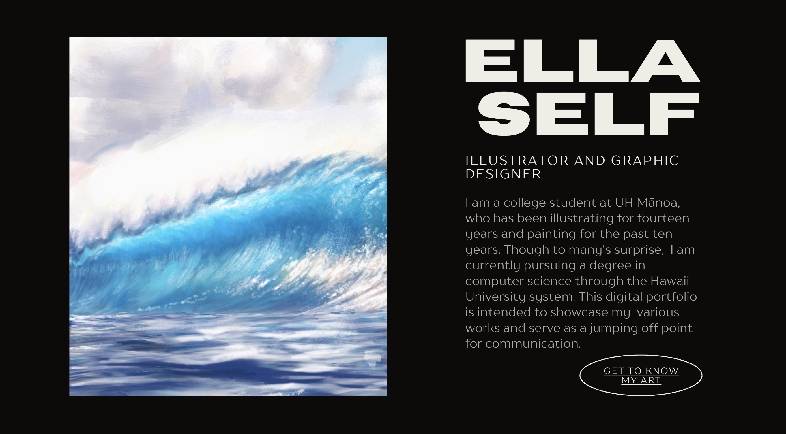
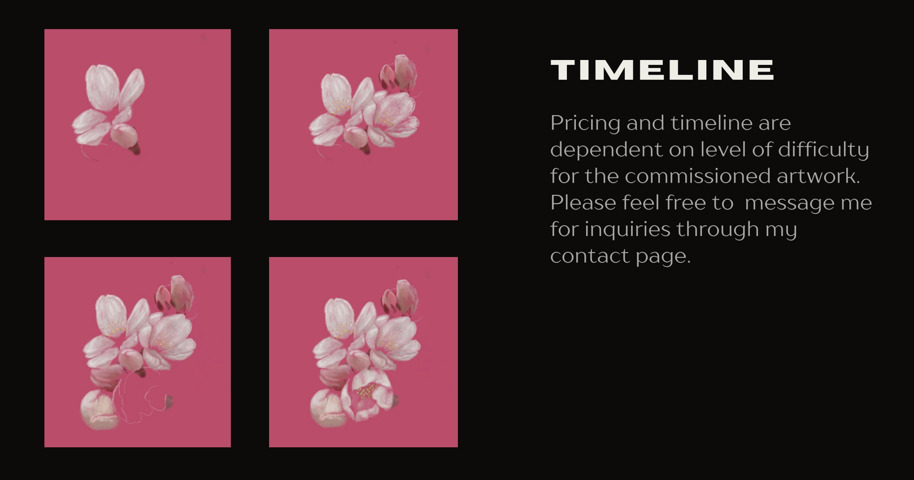

This is one of my first projects related to web development that I had made during quarantine. Before I went back to school, I was a freelance artist for many years. I was commissioned to work on everything, from surfboards, to murals, to digital products. As my business grew, I needed an easy way for prospective clients to contact me. As well as, an application that was convenient to reference and hosted all my previous works.  

More significantly, my portfolio was the first thing that I had done related to computer science. Dveloping my site was extremely fun, in the sense that I got to understand how to design and layout applications the way I wanted. Additionally, it showed me the possibility of what you could do with coding. For all these reasons, I credit this project with being the start of why I chose my degree. 

If you are interested, feel free to visit my site at <a href="https://ellaself.com"> ellaself.com </a>

