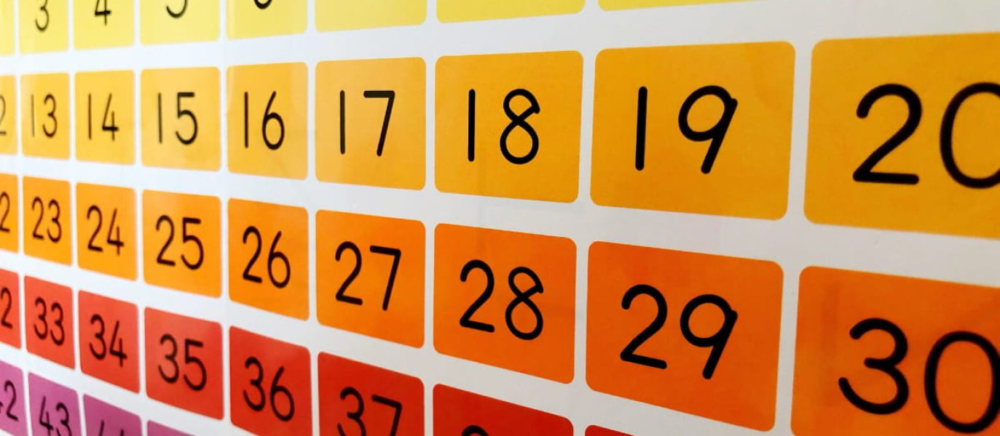

Lós numeros is text-based study tool that I developed using the functions and with C programming. This was built with the intent to fulfill assignment requirements as well as support learning from humanities classes. 

To give you a for instance of this interactive program: 

<pre>

   
 1 = uno
 2 = dos
 3 = tres
 4 = cautro
 5 = cinco
 6 = seis
 7 = siete 
 8 = ocho
 9 = nueve
 10 = diez
 11 = once
 12 = doce
 13 = trece
 14 = cautorce
 15 = quince
 16 = deciseis
 17 = decisiete
 18 = deciocho
 19 = decinueve
 20 = viente 
 21 = vientiuno
 22 = vientidos
 23 = vientitres
 24 = vienticautro
 25 = vienticinco
 26 = vientiseis
 27 = vientisiete 
 28 = vientiocho
 29 = vientinueve
 30 = treinta 
 31 = treinta y uno
 32 = treinta y dos
 33 = treinta y tres
 34 = treinta y cautro
 35 = treinta y cinco
 36 = treinta y seis
 37 = treinta y siete 
 38 = treinta y ocho
 39 = treinta y nueve
 40 = cuarenta 

 .
 .
 .

 9995 = nueve mil novecientos noventa y cinco
 9996 = nueve mil novecientos noventa y seis
 9997 = nueve mil novecientos noventa y siete 
 9998 = nueve mil novecientos noventa y ocho
 9999 = nueve mil novecientos noventa y nueve

Source: <a href="https://github.com/jogarces/ics-313-text-game"><i class="large github icon "></i>jogarces/ics-313-text-game</a>
