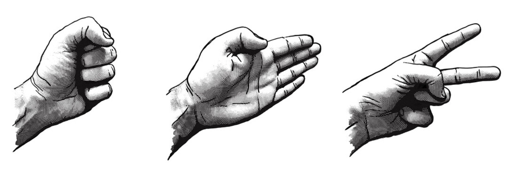

Below is a code segment from my project:

<hr>
  
```cpp

void printInstruct(void);
int  CompTurn(void);    
int calcWinner(int, int);

int main(void){

     //random seeding 
     srand(time(NULL));
     char user = 'a';
     int comp; 
     int input = 0;
     int winner; 
     int userScore = 0, compScore = 0, tieScore = 0; 

    while(user != EOF){
         printInstruct();
         user = getchar();    
         if (user != EOF){
            getchar();
            printf("User entered %c\n", user);
            comp = CompTurn();
            printf("Computer Chose %c\n", comp);
            winner = calcWinner(comp, user);
                while (input > 0){
                    if (winner == 'u'){
                        userScore++;
                    } else if (winner == 'c') {
                        compScore++;
                        printf("You have chosen to quit\n");
                    } else if (winner == 't') {
                        tieScore++;
                    } else {
                        printf("Invalide option");
                    }
                }
            
             printf("Got %c\n", winner);

         } else {  
            printf("You have chosen to quit\n");
            printf("thank you for playing\n");
            printf("Here is the total score\n");
            
            printf("Computer wins: %c\n", compScore);
            printf("user wins: %c\n", userScore);
            printf("ties: %c\n", tieScore);
        } 
    }
    return 0;
} 

```

<hr>
