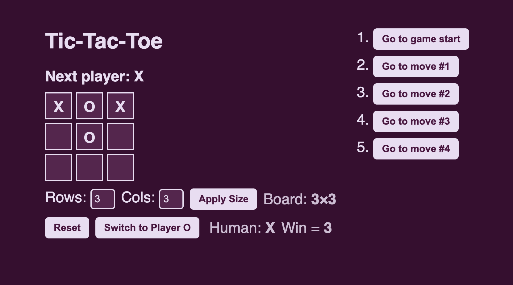

This is one of my first projects that I created using an LLM during my time in ICS 314. My interactive tic-tac-toe game allows you to play against an agent. Additionally, you can adjust the size of the n x n board, changing the size of the rows and columns. Not only that, but you view the series of moves made by both you and your opponent.  
    

 Throughout a series of choices & turns, the agent will counter your moves as you play. The more you play, the better the model will be able to predict your moves and how to beat your winning strategy.

Link to repo: <a href="https://github.com/ellaself/Tic-Tac-Toe">Tic-Tac-Toe </a>

